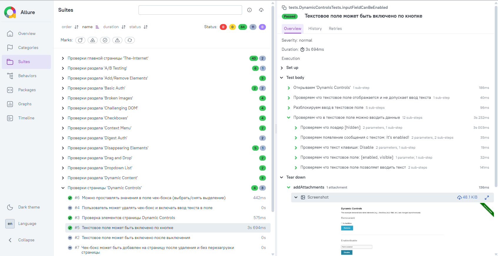

# The Internet HeroKuApp — набор автотестов

[](https://adoptium.net/)
[](https://selenide.org/)
[](https://junit.org/junit5/)
[](https://allurereport.org/)


## О проекте

Этот репозиторий — демонстрация подхода к промышленной автоматизации UI-тестирования на примере классического приложения The Internet HeroKuApp. Здесь нет "игрушечных" тестов — только практики, которые реально работают на крупных проектах.

### Цель

- Писать чистые, поддерживаемые тесты
- Интегрировать Allure для прозрачной отчётности
- Поднимать локальный CI/CD стенд (TeamCity + Selenoid в Docker)
- Готовить тесты к запуску в контейнерной среде

---

## Технологический стек

| Компонент | Технология | Назначение |
|-----------|------------|------------|
| Язык | Java 17 | Основной язык |
| Сборка | Gradle | Управление зависимостями и сборка |
| Фреймворк | Selenide | Лаконичные UI-тесты |
| Тестовый раннер | JUnit 5 | Запуск, параметризация |
| Отчётность | Allure | Шаги, вложения, отчёты |
| Инфраструктура | Docker + Selenoid | Запуск браузеров в контейнерах |
| CI | TeamCity | Автоматический прогон |

---

## Ключевые фишки

### 1. Документированные шаги для Allure

Пример кода:
```java
 @Step("Открыть страницу входа")
 public void openLoginPage() { ... }

 @Step("Ввести логин {username} и пароль, нажать вход")
 public void login(String username, String password) { ... }
```

Allure-отчёт превращается в интерактивный сценарий, понятный даже нетехническому члену команды.

### 2. Page Object + Selenide-стиль

Пример кода:
```java
 $("#username").setValue(username);
 $("#password").setValue(password);
 $("button[type=submit]").click();
```
Читается как документация, не падает от race conditions.

### 3. Готовность к CI/CD

Настроены:
- Запуск в контейнерах (Selenoid)
- Генерация Allure-отчётов (локально, в локальном TeamCity и удаленном GitHub Pages)
- Поддержка параллельного запуска тестов


### 4. Подробный и понятный Allure-отчет:


Живой пример отчета собранный в Github Pages: https://vmaft.github.io/theInternetHeroKuAppTests/

---

### Структура проекта

- src/
  - test/
    - java/
      - pages/
      - tests/
      - steps/
      - utils/
    - resources/
      - allure.properties

>  Примечание: структура находится в процессе наполнения — репозиторий активно развивается.

---

## Как запустить локально

### 1. Поднять Selenoid через Docker

Пример команды:
```bash
 docker run -d --name selenoid -p 4444:4444 aerokube/selenoid:latest-release
```
### 2. Запустить тесты

Пример команды:
```bash
 ./gradlew clean test
```

### 3. Сгенерировать и открыть Allure-отчёт

Пример команд:
```bash
 allure generate build/allure-results --clean
 allure open allure-report
```
---

## Что уже покрыто

- [x] A/B Тесты
- [x] Add/Remove Elements
- [x] Basic Auth (user and pass: admin)
- [x] Broken Images
- [x] Challenging DOM
- [x] Checkboxes
- [x] Context Menu
- [x] Digest Authentication (user and pass: admin)
- [x] Disappearing Elements
- [x] Drag and Drop
- [x] Dropdown
- [x] Dynamic Content
- [x] Dynamic Controls
- [ ] Dynamic Loading
- [ ] Entry Ad
- [ ] Exit Intent
- [ ] File Download
- [ ] File Upload
- [ ] ...
- [ ] Typos
- [ ] WYSIWYG Editor

> Список тестов постоянно пополняется — это активная рабочая песочница.

---

## Обратная связь

Задачи, баги и идеи по развитию — в Issues этого репозитория: https://github.com/VMaft/theInternetHeroKuAppTests/issues

---

## Контакты

Telegram: https://t.me/VadimirMakarov
GitHub: https://github.com/VMaft

---

Если вам заходит подход — ставьте звёздочку, это лучшая благодарность :)
